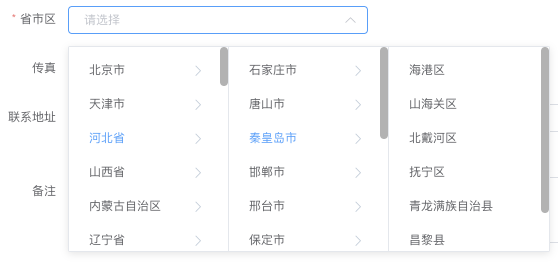

# cn-address-convert

Convert the Chinese address data to tree structure from [vux datas](https://github.com/airyland/vux/tree/v2/src/datas) and use it on element-ui `Cascader` component.



## Run

```
node ./convert.js -s ./china_address_v4.json -o china_address_v4_output.json
```

- `-s`: Data source
- `-o`: Output file
